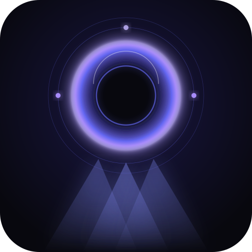

<p align="center">
  
</p>

# Penumbra

> The edge where sound becomes light

Penumbra bridges Ableton Live and DMX lighting hardware. An M4L device streams
your session state in real time to a Go server, which drives WLED/ESP32
fixtures over E1.31 multicast. A PWA gives you monitoring and control from any
device on the network — browser, phone, or tablet.

---

## How it works

```
Ableton Live + M4L
       │
       │  UDP · MessagePack · 40ms
       ▼
   Penumbra Server  ◄────────────────  Browser / PWA
   (Go · single binary)                WebSocket
       │
       │  E1.31 multicast
       ▼
  WLED · ESP32 · DMX
```

The M4L device is a dumb emitter — it reads your session parameters and
broadcasts full state every tick. The server handles everything else: diff
detection, universe partitioning, E1.31 packet construction, and WebSocket
fanout to the UI.

See [docs/architecture.md](docs/architecture.md) for a detailed breakdown.

---

## Features

- **Live session → DMX** — map any Live parameter to any DMX channel
- **E1.31 multicast** — native WLED protocol, no intermediate DMX interface needed
- **Single Go binary** — runs on Mac, Linux, or Raspberry Pi with no runtime dependencies
- **PWA UI** — monitor and configure from any browser on the network
- **Fake emitter** — develop and test the full stack without a Live license

---

## Requirements

| Component | Requirement |
|-----------|-------------|
| M4L device | Ableton Live 11+ with Max for Live |
| Server | macOS, Linux, or Windows (any arch Go supports) |
| UI | Any modern browser |
| Hardware | WLED-flashed ESP32, reachable by multicast |
| Dev tooling | Go 1.25+, Node 20+, pnpm 10+, [Task](https://taskfile.dev) |

A `.nvmrc` is provided — run `nvm use` after cloning.

---

## Getting started

```bash
git clone https://github.com/footgunz/penumbra
cd penumbra && nvm use && task install
task server:dev   # Go server
task watch:ui     # Vite UI (http://localhost:5173)
task fake         # fake emitter (no Live license needed)
```

See [docs/development.md](docs/development.md) for the full dev guide.

---

## Docs

| Document | Description |
|----------|-------------|
| [architecture.md](docs/architecture.md) | System overview, component responsibilities, data flow |
| [protocol.md](docs/protocol.md) | Wire format — UDP, E1.31, WebSocket |
| [config.md](docs/config.md) | `config.json` schema reference |
| [development.md](docs/development.md) | Dev setup, fake emitter, task reference |
| [deployment.md](docs/deployment.md) | Headless Linux/Pi setup and deployment |
| [m4l-device.md](docs/m4l-device.md) | M4L device internals and build |

---

## Stack

- **M4L device** — TypeScript → ES6, compiled with esbuild
- **Server** — Go, single binary, embeds the UI bundle
- **UI** — Vite + React + Tailwind v4 + shadcn/ui, PWA, WebSocket
- **Hardware** — WLED on ESP32, E1.31 / sACN

---

## License

MIT
